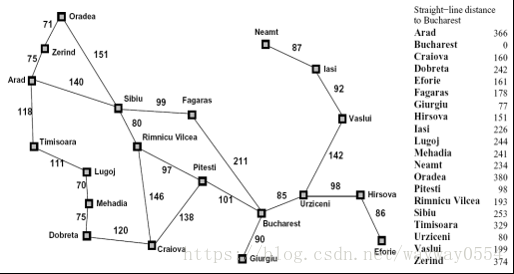
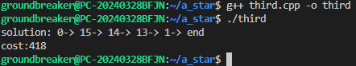

<center><font face="黑体" size=7><b>湖南大学信息科学与工程学院</center>
<center><font face="宋体" size=6>人工智能 课程实验报告</center>
<br>
<font face="宋体" size=4>指导老师：<u>张子兴老师</u> 实验日期：<u>2024</u>年<u>10</u>月<u>24</u>日
<br>
<font face="宋体" size=4>实验项目名称：<u>使用搜索算法实现罗马尼亚问题的求解</u>
<hr>

### 一、实验背景和目标
- 了解有信息搜索策略的算法思想；

- 能够运用计算机语言实现搜索算法；

- 应用$A^*$搜索算法解决罗马尼亚问题；

### 二、实验方法

#### 2.1 A*搜索

- 算法介绍

&emsp;&emsp;$A^*$算法常用于 二维地图路径规划，算法所采用的启发式搜索可以利用实际问题所具备的启发式信息来指导搜索，从而减少搜索范围，控制搜索规模，降低实际问题的复杂度。

- 算法原理

&emsp;&emsp;$A^*$算法的原理是设计一个代价估计函数：其中 **评估函数F(n)** 是从起始节点通过节点n的到达目标节点的最小代价路径的估计值，函数$G(n)$是从起始节点到$n$节点的已走过路径的实际代价，函数$H(n)$是从$n$节点到目标节点可能的最优路径的估计代价 。

&emsp;&emsp;函数$H(n)$表明了算法使用的启发信息，它来源于人对路径规划问题的认识，依赖某种经验估计。根据$F(n)$可以计算出当前节点的代价，并可以对下一次能够到达的节点进行评估。

&emsp;&emsp;采用每次搜索都找到代价值最小的点再继续往外搜索的过程，一步一步找到最优路径。

### 三、实验数据与设置

#### 3.1 编程要求

#### 罗马尼亚问题

&emsp;&emsp;$agent$在罗马尼亚度假，目前位于$Arad$城市。$agent$明天有航班从$Bucharest$起飞，不能改签退票。

&emsp;&emsp;现在你需要寻找到$Bucharest$的最短路径，在右侧编辑器补充$void\ A\_star(int\ goal,\ node\ \&src,\ Graph\ \&graph)$函数，使用编写的搜索算法代码求解罗马尼亚问题：



#### 测试说明
平台会对你编写的代码进行测试：

预期输出：

$solution: 0-> 15-> 14-> 13-> 1-> end$

$cost:418$

### 四、实验结果与分析

#### 4.1 核心代码展示
```cpp
void A_star(int goal,node &src,Graph &graph)
{
    openList.push_back(src);
    sort(openList.begin(), openList.end());
    
    while (!openList.empty())
    {
        /********** Begin **********/
		node cur = openList[0];
        if (cur.name == goal)
            return;
        openList.erase(openList.begin());
        closeList[cur.name] = true;
        for (int i = 0; i < 20; i++)
        {
            if (graph.getEdge(cur.name, i) != -1 && !closeList[i])
            {
                int g_ = cur.g + graph.getEdge(cur.name, i);
                int h_ = h[i];
                int f_ = g_ + h_;
                node next(i, g_, h_);
                if (!list[i])
                {
                    list[i] = true;
                    parent[i] = cur.name;
                    openList.push_back(next);
                }
                else
                {
                    if (f_ < openList[i].f)
                    {
                        openList[i] = next;
                        parent[i] = cur.name;
                    }
                }
            }
        }
        sort(openList.begin(), openList.end());
		/********** End **********/  
    }
}
```

#### 4.2 核心代码分析

&emsp;&emsp;函数$A\_star$接受三个参数：目标节点的名称$goal$，起始节点$src$的引用，以及图$graph$的引用。首先，起始节点被添加到$openList$中，并对$openList$进行排序。$openList$是一个通过每次排序的数组实现的优先队列，存储待处理的节点，按估计的总代价排序。

&emsp;&emsp;在主循环中，算法从$openList$中取出代价最小的节点$cur$。如果$cur$是目标节点，算法结束并返回。否则，将$cur$从$openList$中移除，并将其标记为已处理（即加入$closeList$）。

&emsp;&emsp;接下来，算法遍历当前节点$cur$的所有邻接节点。如果邻接节点与当前节点之间存在边且该邻接节点未被处理，算法计算从起点到该邻接节点的实际代价$g\_$，以及从该邻接节点到目标节点的启发式估计代价$h\_$，两者之和为总代价$f\_$。然后，创建一个新的节点$next$，表示邻接节点。

&emsp;&emsp;如果邻接节点不在$openList$中，算法将其加入$openList$并记录其父节点为当前节点$cur$。如果邻接节点已经在$openList$中，但新的总代价$f\_$更小，算法更新$openList$中的该节点，并更新其父节点为当前节点$cur$。

&emsp;&emsp;每次处理完一个节点后，算法对$openList$重新排序，以确保下一个处理的节点是代价最小的节点。这个过程不断重复，直到找到目标节点或$openList$为空。

#### 4.3 实验结果



如图所示代码运行正确，实现题目要求目的

### 五、总结与展望
#### 5.1总结
&emsp;&emsp;在本次实验中，我成功地实现了A*搜索算法，并应用该算法解决了罗马尼亚问题。通过实验，我达到了以下目标：

1. 理解了$A^*$算法的基本原理：$A^*$算法结合了广度优先搜索和贪心搜索的优点，通过估算从当前节点到目标节点的代价来指导搜索方向，从而高效地找到最短路径。

2. 掌握了$A^*$算法的实现方法：通过编写代码，我熟悉了如何使用优先队列管理待处理节点，并通过估算代价来选择最优路径。

3. 验证了算法的正确性：通过实验结果，我验证了所编写的$A^*$算法能够正确地找到从$Arad$到$Bucharest$的最短路径，并计算出相应的代价。

#### 5.2展望
在未来的工作中，我可以进一步优化和扩展$A^*$算法的应用：

1. 优化算法性能：当前实现的$A^*$算法使用数组进行优先队列的管理，每次插入和删除操作都需要进行排序，效率较低。可以考虑使用堆数据结构来优化优先队列的操作，提高算法的性能。

2. 扩展算法应用场景：$A^*$算法不仅可以用于二维地图的路径规划，还可以应用于其他领域，如机器人导航、游戏AI、网络路由等。我可以尝试将A算法应用到更多实际问题中，验证其通用性和有效性。

3. 结合其他启发式算法：$A^*$算法依赖于启发式函数的设计，不同的启发式函数会影响算法的搜索效率。可以尝试结合其他启发式算法，如Dijkstra算法、贪心算法等，进一步提高搜索效率和路径质量。

4. 研究算法的改进版本：在A算法的基础上，还有许多改进版本，如IDA、Theta*等。这些改进版本在不同场景下可能具有更好的性能和效果，可以进一步研究和实现这些改进算法。

&emsp;&emsp;通过本次实验，我不仅掌握了$A^*$算法的基本原理和实现方法，还为未来的研究和应用打下了坚实的基础。希望在后续的学习和工作中，能够不断探索和优化搜索算法，解决更多复杂的实际问题。