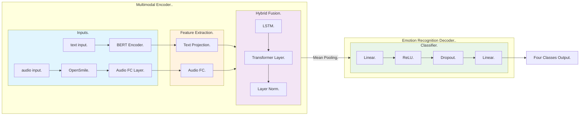
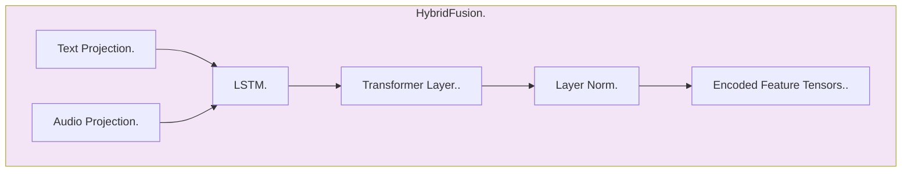
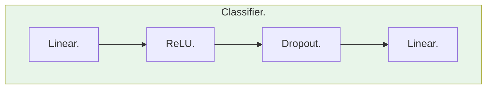

<center><font face="黑体" size=7><b>湖南大学信息科学与工程学院</center>
<center><font face="宋体" size=6>人工智能 课程实验报告</center>
<br>
<font face="宋体" size=4>指导老师：<u>张子兴老师</u> 实验日期：<u>2025</u>年<u>1</u>月<u>7</u>日
<br>
<font face="宋体" size=4>实验项目名称：<u>音频、文本多模态深度学习</u>
<hr>

## 一、	实验背景与目标

本实验任务是通过文本数据进行情感识别任务，实现音频、文本多模态深度学习。

## 二、	数据集和数据处理

### 2.1 数据集概况
略，见[实验指导书](../../实验作业二三四说明.md)

### 2.2 数据预处理

- **音频数据处理**
音频数据预处理方式与[实验二](../lab2/hw2_report.md)相同，这里略
- **文本数据处理**
文本数据预处理方式与[实验三](../lab3/hw3_report.md)相同，这里略

## 三、 模型设计与实现

### 3.1 模型设计
本实验采用的多模态模型由两部分组成，**模态融合编码器 (ME, Multimodal Encoder)**和**情感分类解码器 (ERD, Emotion Recognition Decoder)**。在 ME 中，音频和文本数据分别经过两个编码器提取特征。在 ERD 中，融合后的特征经过多层神经网络进行情感分类。两个模块直接通过 Mean Pooling 进行连接，以保证数据特征的一致性。整体结构示意图如下：
<center>


Fig. 1. Model Architecture
</center>

### 3.2 **ME (Multi-modal Encoder)**

#### 3.2.1 **文本编码器**
文本编码器使用预训练的 BERT 模型对文本进行编码。BERT 模型是一个常用的预训练 LLM 模型，由多层 Transformer 编码器组成，常用于文本分类、文本生成等任务。^[Kenton, Jacob Devlin Ming-Wei Chang, and Lee Kristina Toutanova. "Bert: Pre-training of deep bidirectional transformers for language understanding." Proceedings of naacL-HLT. Vol. 1. 2019.] 具体步骤如下：

1. 文本输入通过 BERT 模型进行编码，提取出768维的文本特征。
2. 使用线性层将 BERT 输出的768维特征投影到256维。
<center>


Fig. 2. Text Encoder
</center>

#### 3.2.2 **音频编码器**
音频编码器使用 OpenSmile 提取音频特征，并通过全连接层进行处理。OpenSmile 是一个用于音频特征提取的工具包，可以提取音频的多种特征，如梅尔频谱系数、音频能量等。^[Eyben, Florian, Martin Wöllmer, and Björn Schuller. "Opensmile: the munich versatile and fast open-source audio feature extractor." Proceedings of the 18th ACM international conference on Multimedia. 2010.] 具体步骤如下：

1. 使用 OpenSmile 提取音频特征，得到88维的音频特征。
2. 使用全连接层将88维的音频特征投影到256维。
<center>


Fig. 3. Audio Encoder
</center>

#### 3.2.3 **模态融合**
特征融合层采用混合融合策略，结合 LSTM 和 Transformer 来处理文本和音频特征的交互。

- **LSTM (Long Short-Term Memory)** 是一种常用的循环神经网络，可以处理序列数据，捕捉序列之间的依赖关系。这种网络在处理文本、音频等序列数据时表现出色。^[Graves, Alex, and Alex Graves. "Long short-term memory." Supervised sequence labelling with recurrent neural networks (2012): 37-45.]

- **Transformer** 是一种基于注意力机制的模型，可以处理序列数据之间的交互关系。这种模型在处理长距离依赖关系时表现出色。^[Vaswani, A. "Attention is all you need." Advances in Neural Information Processing Systems (2017).]

本模型将 LSTM 和 Transformer 结合在一起，用于处理文本和音频特征之间的交互关系。具体步骤如下：

1. 将文本和音频特征堆叠成形状为`[batch_size, 2, 256]`的张量。
2. 使用双向LSTM处理序列依赖，输出形状为`[batch_size, 2, 512]`的张量。
3. 使用Transformer处理模态间的交互，输出形状为`[batch_size, 2, 512]`的张量。
4. 通过 LayerNorm 进行归一化处理。
<center>


Fig. 4. Hybrid Fusion
</center>

### 3.3 **ERD (Emotion Recognition Decoder)**

情感分类解码器使用多层神经网络对融合后的特征进行分类。具体步骤如下：

1. 对融合后的特征进行平均池化，得到形状为`[batch_size, 512]`的张量。
2. 使用全连接层将512维特征映射到256维，并进行 ReLU 激活和 Dropout 处理。
3. 使用全连接层将256维特征映射到最终的情感分类结果。
<center>


Fig. 5. Classifier
</center>

### 3.4 **损失函数和优化器**

#### 3.4.1 损失函数
本实验使用标签平滑交叉熵损失函数 (Label Smoothing Cross Entropy)。^[Mannor, Shie, Dori Peleg, and Reuven Rubinstein. "The cross entropy method for classification." Proceedings of the 22nd international conference on Machine learning. 2005.] 标签平滑是一种正则化技术，通过在目标标签上添加噪声来防止模型过拟合。具体来说，它将目标标签的置信度从1.0降低到一个较小的值（如0.85），并将剩余的置信度均匀分配给其他类别。这种方法可以使模型在训练过程中更加鲁棒，减少过拟合的风险。公式如下：

$$
\text{Loss} = -\sum_{i=1}^{C} y_i \log(p_i) \tag{1}
$$
其中，$C$ 是类别数，$y_i$ 是标签平滑后的目标值，$p_i$ 是模型预测的概率。

#### 3.4.2 优化器
本实验使用 AdamW 优化器进行模型训练。AdamW 是 Adam 优化器的变种，结合了权重衰减 (Weight Decay) 技术。^[Loshchilov, Ilya, and Frank Hutter. "Fixing weight decay regularization in adam." arXiv preprint arXiv:1711.05101 5 (2017).] 权重衰减是一种正则化方法，通过在损失函数中添加权重的 L2 范数来防止过拟合。AdamW 优化器在训练过程中能够自适应地调整学习率，并且结合了权重衰减技术，使得模型在训练过程中更加稳定，具有更好的泛化能力。公式如下：

$$
\theta_{t+1} = \theta_t - \frac{\eta}{\sqrt{\hat{v}_t} + \epsilon} \hat{m}_t \tag{2}
$$
其中，$\theta_t$ 是参数，$\eta$ 是学习率，$\hat{m}_t$ 是梯度的指数移动平均，$\hat{v}_t$ 是梯度平方的指数移动平均，$\epsilon$ 是一个很小的数，用于防止除零错误。

## 四、 实验结果与分析

### 4.1 实验环境
| 环境         | 配置                                                       |
|--------------|------------------------------------------------------------|
| 硬件环境     | Intel(R) Xeon(R) Gold 6138 CPU @ 2.00GHz, NVIDIA A100 80GB PCIe |
| 软件环境     | Python 3.8, PyTorch 2.0.1, Transformers 4.46.3             |
<center>
Chart 1. Experiment Environment
</center>

### 4.2 评估指标
本模型采用准确率 (Accuracy), 精确率 (Precision), 召回率 (Recall)， F1 值 (F1 Score) 和混淆矩阵 (Confusion Matrix) 作为评估指标。这些指标可以帮助我们评估模型在情感分类任务上的性能。
- **准确率 (Accuracy)**: 分类正确的样本数占总样本数的比例。
$$
\text{Accuracy} = \frac{\text{TP} + \text{TN}}{\text{TP} + \text{TN} + \text{FP} + \text{FN}} \tag{3}
$$
- **精确率 (Precision)**: 正确预测为正类别的样本数占所有预测为正类别的样本数的比例。
$$
\text{Precision} = \frac{\text{TP}}{\text{TP} + \text{FP}} \tag{4}
$$
- **召回率 (Recall)**: 正确预测为正类别的样本数占所有真实为正类别的样本数的比例。
$$
\text{Recall} = \frac{\text{TP}}{\text{TP} + \text{FN}} \tag{5}
$$
- **F1 值 (F1 Score)**: 精确率和召回率的调和平均数。
$$
\text{F1} = \frac{2 \times \text{Precision} \times \text{Recall}}{\text{Precision} + \text{Recall}} \tag{6}
$$
- **混淆矩阵 (Confusion Matrix)**: 用于展示模型在不同类别上的分类情况。 `CM[i][j]` 表示真实类别为 `i`，预测类别为 `j` 的样本数。

### 4.3 实验结果

训练中的输出如下：

```shell
Epoch 1/15: 100%|.|██████████████████████████████| 102/102 [00:45<00:00,  2.25it/s]
Train Loss: 1.3601
Val Acc: 0.5238, Val F1: 0.4289
Confusion Matrix:
[[189  34 104   0]
 [ 17 123 163   0]
 [ 16  14 228   0]
 [  1   0 142   0]]
F1 Score improved, saving model.

--------------------------------------------------
Epoch 2/15: 100%|.|██████████████████████████████| 102/102 [00:43<00:00,  2.34it/s]
Train Loss: 1.1340
Val Acc: 0.6887, Val F1: 0.6906
Confusion Matrix:
[[231  24  71   1]
 [ 28 207  59   9]
 [ 18  42 179  19]
 [  2  11  37  93]]
F1 Score improved, saving model.

--------------------------------------------------
Epoch 3/15: 100%|.|██████████████████████████████| 102/102 [00:43<00:00,  2.34it/s]
Train Loss: 0.9046
Val Acc: 0.6877, Val F1: 0.6942
Confusion Matrix:
[[230  13  81   3]
 [ 21 182  81  19]
 [ 16  25 183  34]
 [  2   1  26 114]]
F1 Score improved, saving model.

--------------------------------------------------
...
Epoch 11/15: 100%|.|█████████████████████████████| 102/102 [00:43<00:00,  2.35it/s]
Train Loss: 0.5776
Val Acc: 0.7420, Val F1: 0.7503
Confusion Matrix:
[[225  10  84   8]
 [ 21 221  50  11]
 [  5  36 197  20]
 [  1   4  16 122]]
F1 Score improved, saving model.

--------------------------------------------------
...
Epoch 15/15: 100%|.|█████████████████████████████| 102/102 [00:43<00:00,  2.35it/s]
Train Loss: 0.5559
Val Acc: 0.7236, Val F1: 0.7325
Confusion Matrix:
[[219  12  88   8]
 [ 16 220  58   9]
 [  8  37 183  30]
 [  1   3  15 124]]
--------------------------------------------------
Training finished. Dev F1: 0.7503
测试集预测结果已成功写入到文件中！
```

通过 15 轮训练，模型在训练集上的损失逐渐下降，验证集上的准确率和 F1 值逐渐提升。最终模型在验证集上的 F1 值为 0.7503，表现较好。混淆矩阵显示模型在不同类别上的分类情况，可以看出模型在不同类别上的分类效果较为均衡。

## 五、总结与展望

本模型通过音频、文本多模态深度学习，实现了情感识别任务。模型采用了 ME 和 ERD 两个模块，通过特征提取、特征融合和分类预测三个步骤完成情感分类任务。实验结果表明，模型在验证集上的 F1 值为 0.7503，表现较好。

在未来的工作中，可以进一步优化模型结构，提高模型的性能。同时，可以尝试使用更多的数据进行训练，提高模型的泛化能力。另外，可以尝试使用其他的预训练模型，如 RoBERTa、XLNet 等，进一步提升模型的性能。
